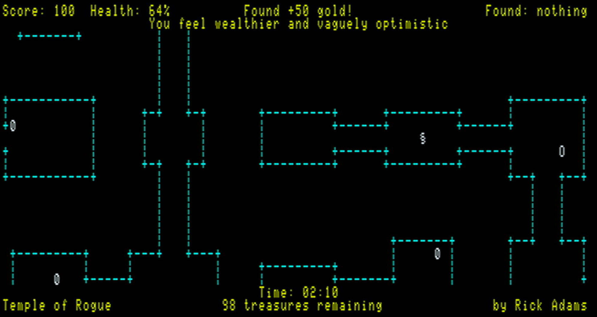

Temple of Rogue
==========

Attempting to make a roguelike with some features inspired by my previous game Temple of ROM.

Work in progress.  Not anywhere near playable yet.

**Todo**

- Make this into some kind of reasonable game

**Done**

- Page flipping
- Proper dungeon maze creation
- Reduce complexity of the maze to make it look prettier and less crowded
- Constrain scrolling
- Draw player and scroll him around
- Number displaying routines to put values into the status areas
- Keyboard repeat
- Draw player and objects in white
- Map creation
- Zero suppress numbers
- Indicate total number of objects
- Handle double precision numbers
- Show transient status messages
- Format the status lines a bit more sensibly
- Fix map creation bug
- Implement keys and doors
